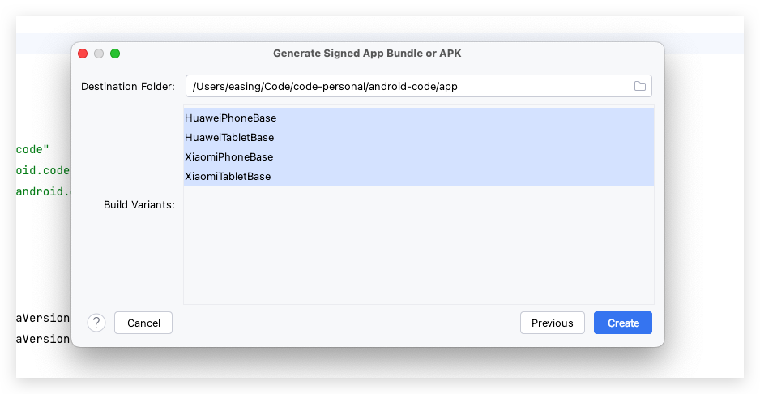
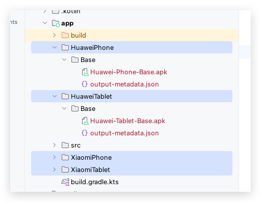

##### Why This Blog

- Latest Way with KTS and Gradle 8.0+
- Comprehensive Clear and Concise
- Details Most Blogs Not Mentioned

##### Intent

Assume that we want to build multiple apk files, for different soft markets and different devices

We can easily acheive this by configuring gradle script like this

***app/build.gradle.kts***

```kotlin
android {

    flavorDimensions += listOf("market", "platform")

    productFlavors {
        create("Huawei") {
            isDefault = true
            dimension = "market"
        }
        create("Xiaomi") {
            dimension = "market"
        }
        create("Phone") {
            isDefault = true
            dimension = "platform"
        }
        create("Tablet") {
            dimension = "platform"
        }
    }

    signingConfigs {
        create("common") {
            storeFile = File(rootProject.projectDir, "sign.keystore")
            storePassword = "123456"
            keyAlias = "signKey"
            keyPassword = "123456"
            enableV2Signing = true
        }
    }

    buildTypes {
        create("Base") {
            isDefault = true
            isDebuggable = true
            isJniDebuggable = true
            isMinifyEnabled = false
            isShrinkResources = false
            signingConfig = signingConfigs.getByName("common")
        }
    }

    androidComponents {
        beforeVariants(selector().withBuildType("debug")) { it.enable = false }
        beforeVariants(selector().withBuildType("release")) { it.enable = false }
        onVariants { variant ->
            val buildType = variant.buildType
            val market = variant.productFlavors.first { it.first == "market" }.second
            val platform = variant.productFlavors.first { it.first == "platform" }.second
            val apkName = "$market-$platform-$buildType.apk"
            variant.outputs.forEach { output ->
                val output = output as VariantOutputImpl
                output.outputFileName = apkName
            }
        }
    }
}
```

##### Build Multiple Apks

`Build - Generate Signed APK`





We get somthing like these under directory `app` , in format `Dimen1Dimen2/BuildType/Dimen1-Dimen2-BuildType.apk`

That's really simple and perfect, matching our requirements

Next, let's discover more details in kts script

##### Dimensions

We can define any number of dimensions

Then package apks for any composition of these dimensions and build types

##### Flavors

Flavor is a specific dimension value

That is a dimension includes multiple flavor values

##### BuildTypes

BuildType designed to distinguish from debug or release purposes

Android-Gradle-Plugin offers two default configs, named `debug` and `release`

We can create a new instance, under the dsl object `buildTypes`

##### SigningConfigs

Define signature file and password

We can define multiple configs, and dynamically choose for specific build type

##### Variant

We can build multiple apks, with changes of different factors

A variant is a apk that decided by specific dimension and build type

##### Build Default APK

When we build single apk by `Build - Build APK`

Gradle build a single apk file, using default dimension flavor and build type

Default value of flavor is the first defined items for each dimension

Default value of build type is `debug`

##### Set DefaultVariant

We can use `isDefault` property to set default dimension and build type

##### Build Specific Variant

If you don't want to output default apk, when build single apk by `Build - Build APK`

You can change default build config by `Build - Select Build Variant`

##### Custom Output APK Name

Apk names can be customized by property `variant.output.outputFileName`

This property can be modified under the dsl object `androidComponents.onVariants`

##### Remove Built-In Build Types

If you don't need to use `release` and `debug` , you just want to use the customized one

Furthermore,  your don't even want to see them

You can disable them by property `enable` under dsl object `androidComponents.beforeVariants`

##### Specify Variable Values for Different Variant

You can also change value of gradle object and manifest object, for various variants

We will talk about this in next blog

##### Bless

Lesson is Over, Have A Rest, and Enjoy Your Life .

Good Work, Good Study, Good Progress, and Good Mood !
